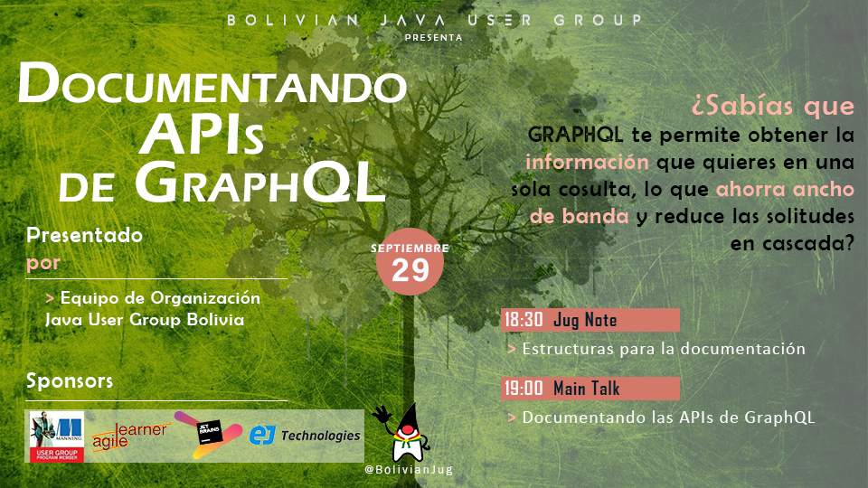
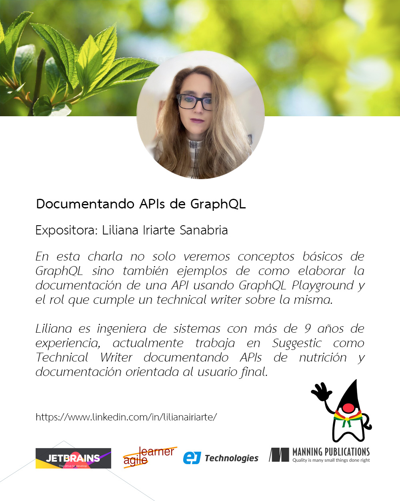
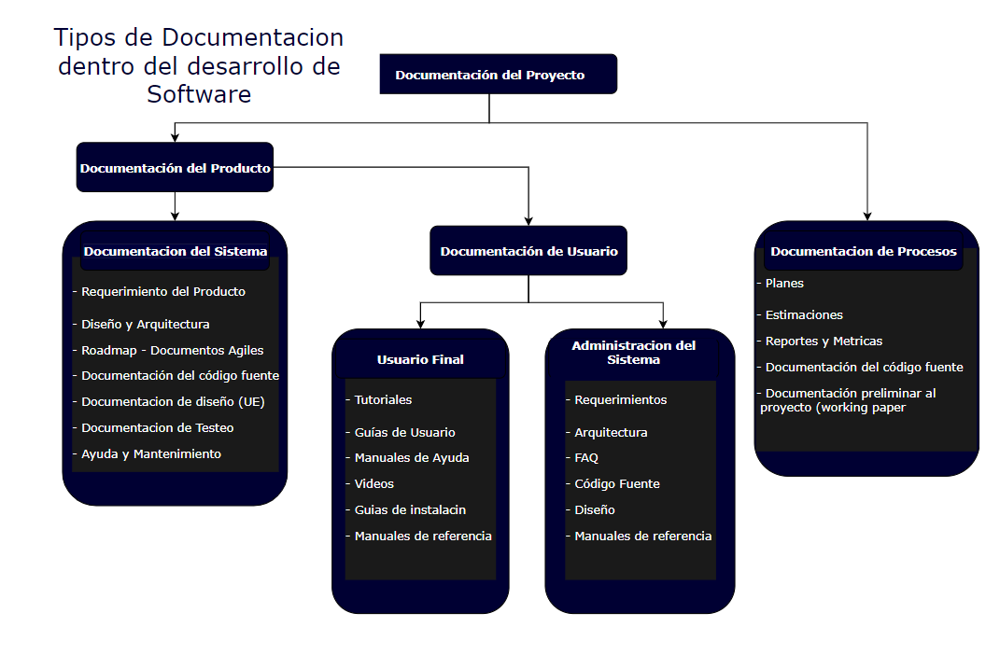

# Documentando APIs de GraphQL
Recursos del evento de septiembre de 2021.

## Evento
Para volver a ver el evento haz click en la imagen:
  

## Conoce a nuestra invitada de este mes:
  
  

## JUG Note

  
 
  
## Recursos 
- Para ver los slides de la charla de Lili sigue este [enlace.](source/Documentando APIS de GraphQL.pdf)
